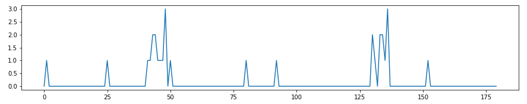
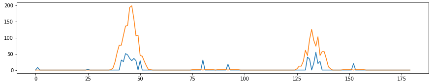

# **Finding Lane Lines on the Road** 

Pipeline.
---
Piplene for finding lane lines on the road for both images and videos includes several steps:

1) Converting image to grayscale in order to be able to detect edges via Canny algorithm regardless of the color. 
   
2) Blur the image in order to reduce the amount of noise . 
   
3) Apply Canny algorithm which allows to detect edges . 
   
4) We know that the road in most cases belongs to the bottom half of the image and also that we can generally ignore areas close to the left and right edge of image because of linear perspective. So we crop the region of interest accordingly 
   
5) Using hough transform algorithm find lines on image. The algorithm is configured in a way to find lane lines on the road and ignore as much noise lines as possible. 
   
6) When we get the lines, we start to process them so that get lane lines.
7) First of all extract info about angle, length and coordinate of line's projection to the OX axis (in our case it is the bottom border of image)
8) Based on angles extracted we create histogram in order to find out which directions are mostly headed by segments to:
    
9) Once we have distribution of lines' angles, we apply weights to this histogram. We use line's length as a weight, so the longer the line the greater influence it would have.
10) For each line we calculate the number of 'neighboors' - lines with similar angle values. When calculating it we use so called frame - range (degrees) in which 2 lines are treated as neighboors
11) For each line in histogram we apply new weight that is calculated as multiplication of number of neighboorhods and their total length.
12) We mix up distributions we get previously applying the impact coefficients for own length and total neighboors length, so that in the result distribution the most 'popular' directions which are made by the the longest segments would have significally greater values than other noisy signals.
On the picture you could see distribution with own_length_weight applied (blue) and the distribution we get after applying neighboors_weight (orange)
  
13) Smooth and normalize result ditribution:
  
14) Extract peak values - angles of lane lines
15) Filter all the lines we had in the very beginning and leave only those ones, which angle is similar to the target values
16) Find the average value of crooss-axis point for the each lines subset.
17) Draw lines using the value of angle and initial point in the bottom of the image
  

Identify potential shortcomings with your current pipeline
---
Pipeline is in general based on assumption that lanes are straight and that these lanes are the only objects on the image which could made up continuous lines.

We can not guarantee that the line we detected is the lane line. It could possibly be the edge between road and roadside, roadblock or simply a trailer.

Also this algorithm can not be used for example in winter or in heavy weather conditions

Suggest possible improvements to your pipeline
---
We can use lines data across several frames of video stream. It would allow to significally reduce amount of flickering and smooth the angle assessment.

Also we can use line's position as a criteria of line detecting. For example now two lines with the same angles would be treated as similar regardless whether they are close to each other on in the opposite corners of the image